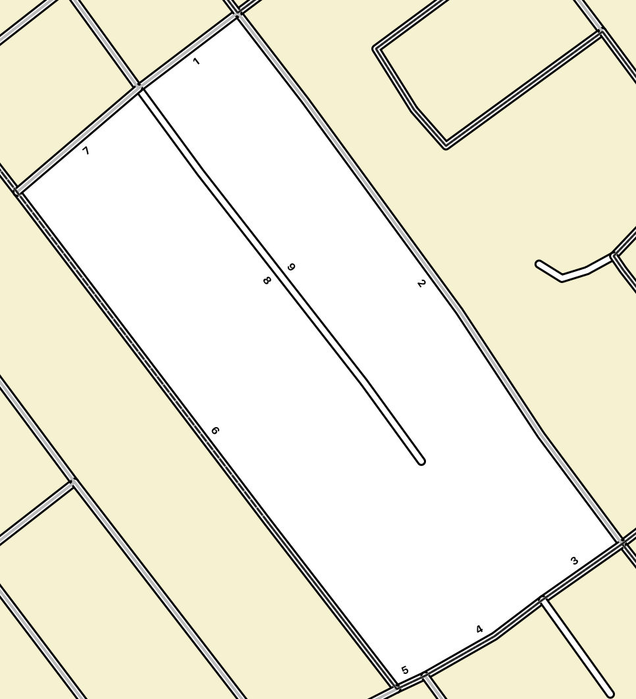
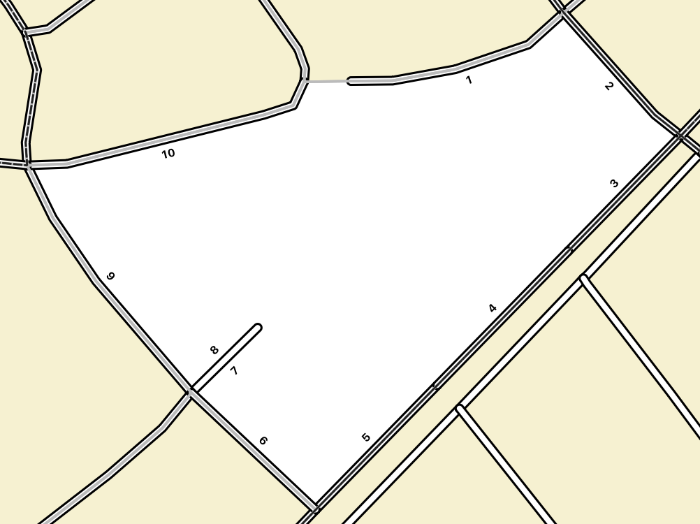
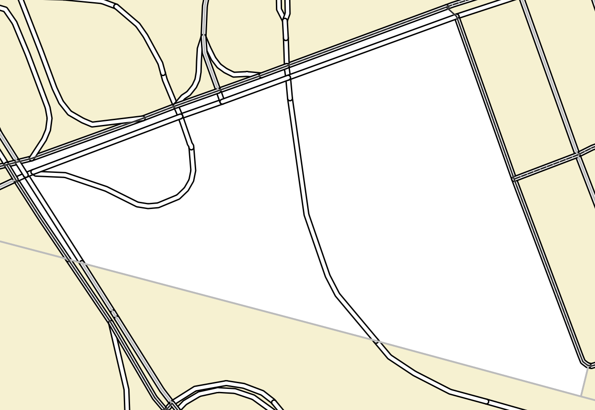

# How It Works

Sequencing an areas means traversing all of the road edges that comprise a child geography without leaving that geography, and enumerating all of the child geographies within a larger parent unit.

Several algorithms are applied to help accomplish this, depending on the type of network being formed by the road edges within each child block.

## Block Ordering

Before processing the edges within each block, the most efficient order to visit each block is first determined. This uses the representative points found within the block data file to calculate the solution as a [Travelling Salesman Problem](https://en.wikipedia.org/wiki/Travelling_salesman_problem). A [Genetic Algorithm](https://en.wikipedia.org/wiki/Genetic_algorithm) is used to determine the best route through all of the blocks.


The block ordering process tries to find the shortest distance through which to visit all of the child blocks within the parent geography. The genetic algorithm does this by continuously evolving the block order, evaluating the distance between all of the representative points provided and returning the shortest total path.

By default the algorithm is allowed to try a maximum of 1000 evolutions. This number can be increased to find the optimal order for areas with a larger number of child blocks, but processing will take longer.

The number of combinations to try when searching for the optimal block order is a result of the factorial of the number of child blocks. As the number of combinations grows very quickly, only parent geographies with a relatively low number of blocks are guaranteed to result in the most efficient route. Parent geographies with a lot of child blocks will return the most efficient path that was found within the alloted evolution count.

An example of how the number of child blocks can quickly exhaust the available examination space.

```
>>> import math
>>> math.factorial(3)
6
>>> math.factorial(5)
120
>>> math.factorial(9)
362880
```

## Edge Ordering

Edge ordering is different from block ordering in that the problem is not really that of the Travelling Salesman. Instead, the goal is to visit every edge, ideally as few times as possible.

The edges within each block are ordered sequentially starting with the number 1. Although the road edges within a block can be organized in many different ways, they fall into three broad categories.

1. Blocks that form a closed circuit
2. Blocks that form a path
3. Blocks that will require at least some backtracking to traverse all edges

The ideal way to traverse a given set of edges is using the "right hand rule", meaning the enumerator will turn right at all intersections to complete their route. This makes traversal more efficient, since they don't need to waste time trying to cross intersections, but also increases safety as they have limited interactions with street traffic.

The ordering of edges within this application is done throught he use of the [NetworkX](https://networkx.github.io/documentation/stable/index.html) package. This package implements the algorithms required to traverse the road networks encountered, and traverses even large amounts of data fairly efficiently.

### Closed Circuits

A block where all of its edges for a connected graph and every vertex has even degree forms a Euler cycle. This type of block is the easiest to traverse, as it does not really matter where the enumerator starts; they will be able to walk every edge in order and return to the start point.



Luckily, a Euler cycle can be solved in linear time, so finding routes in areas like this is quite efficient.

### Paths

The second type of route encountered is a block that does not form a complete circuit, but does still have a road network where all vertices have even degree, except for the first and last vertex in the sequence.

This type of network is formed when some feature causes the roads not to fully connect, but a boundary exists to close the block regardless. A common occurrence for this type of block is due to a river or administrative boundary splitting an otherwise complete cycle in half.



In these types of graphs there is really only one viable start point - due to the aforementioned right hand rule. Similar to the Euler cycle above, these types of routes can be enumerated in linear time.

### Blocks with Backtracking

By definition, a Euler cycle will not visit the same edge twice, thus preventing backtracking and providing an optimal route to visit every edge. While it is not overly common, there are times where a block is split by some feature that results in a road network that will require backtracking. This is a variant of a Euler cycle known as the [Route Inspection Problem](https://en.wikipedia.org/wiki/Route_inspection_problem).



This type of block is routed by first finding the shortest path between vertices that are "dead-ends" in the sense that an enumerator will have to turn around at the end of an edge and adding "augmented" edges along that path. This may not be a real dead-end on the road network. Once all the augmented edges are added, the resulting graph is now a Euler circuit and can be solved in a fashion similar to block type 1. The only difference is that any of the augmented edges are not assigned a sequence number, so the final sequence will not form a nicely ordered set of values. For the purposes of enumeration this is not an issue, and is the indicator to the enumerator that they will need to backtrack.