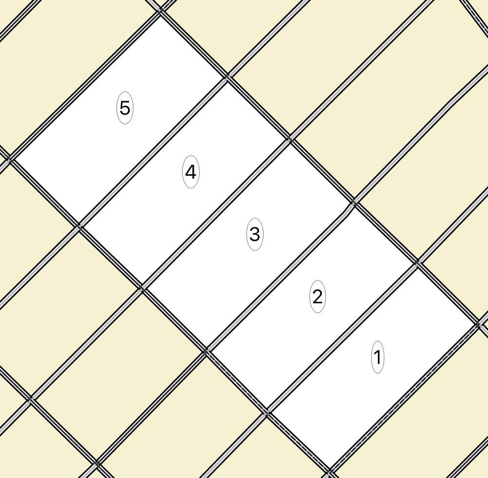

# How It Works

Sequencing an areas means traversing all of the road edges that comprise a child geography without leaving that geography, and enumerating all of the child geographies within a larger parent unit.

Several algorithms are applied to help accomplish this, depending on the type of network being formed by the road edges within each child block.

## Block Ordering

Before processing the edges within each block, the most efficient order to visit each block is first determined. This uses the representative points found within the block data file to calculate the solution as a [Travelling Salesman Problem](https://en.wikipedia.org/wiki/Travelling_salesman_problem). A [Genetic Algorithm](https://en.wikipedia.org/wiki/Genetic_algorithm) is used to determine the best route through all of the blocks.



The block ordering process tries to find the shortest distance through which to visit all of the child blocks within the parent geography. The genetic algorithm does this by continuously evolving the block order, evaluating the distance between all of the representative points provided and returning the shortest total path.

By default the algorithm is allowed to try a maximum of 1000 evolutions. This number can be increased to find the optimal order for areas with a larger number of child blocks, but processing will take longer.

The number of combinations to try when searching for the optimal block order is a result of the factorial of the number of child blocks. As the number of combinations grows very quickly, only parent geographies with a relatively low number of blocks are guaranteed to result in the most efficient route. Parent geographies with a lot of child blocks will return the most efficient path that was found within the alloted evolution count.

An example of how the number of child blocks can quickly exhaust the available examination space.

```
>>> import math
>>> math.factorial(3)
6
>>> math.factorial(5)
120
>>> math.factorial(9)
362880
```

