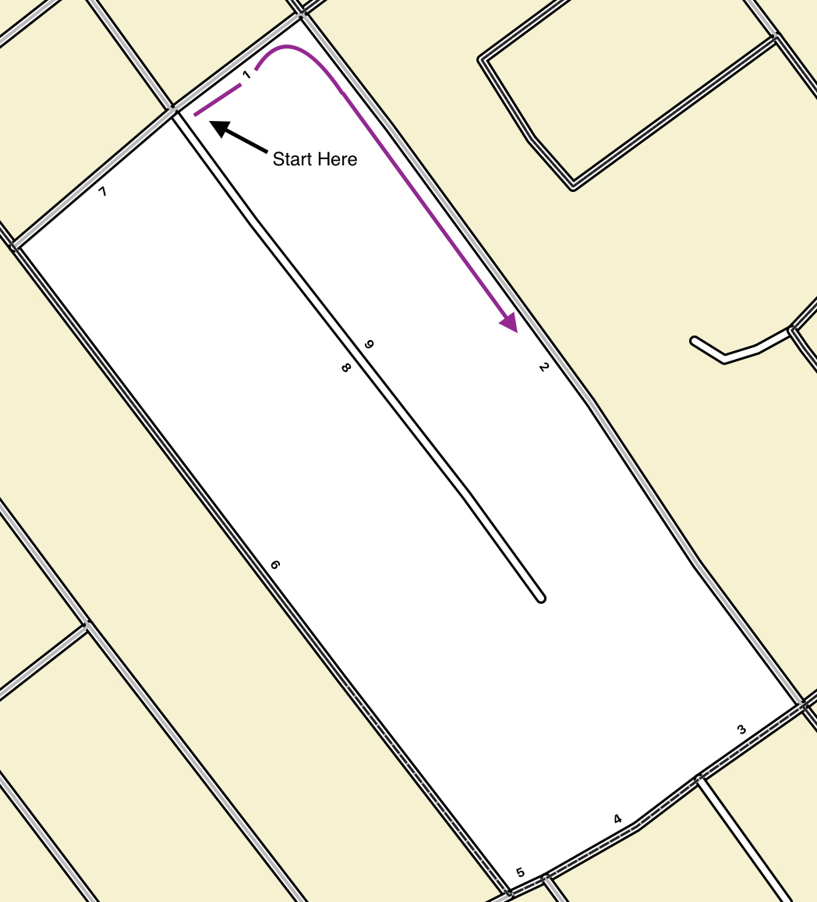

# Explanation of sequencing

The main reason that Sequencing is needed is to provide the starting locations and routes for enumerators to travel door to door in areas where they are gathering information for surveys. It also orders the blocks within a parent geography, known 
as a [Unit](https://statswiki.unece.org/display/hlgbas/Statistical+Units). Units are further broken down into blocks, which are composed of a set of roads and other features that create an enclosed area through which an enumerator will collect information. Collection within a unit is considered complete once all of its blocks have been enumerated.

By ordering the road edges, or block faces (BF), for the enumerator, sequencing helps to minimize the total distance an enumerator needs to travel to cover an area. This lessens the chances of backtracking or doubling over streets that have already been visited.

Statistics Canada does not currently use digital field collection tablets to automatically route enumerators from one dwelling to the next. Block sequencing is therefore used to produce routes by area which are then output as paper maps. Paper maps in three different standardized sizes are produced for field workers, showing an optimized start point from which they can begin collection in each block within their unit.
