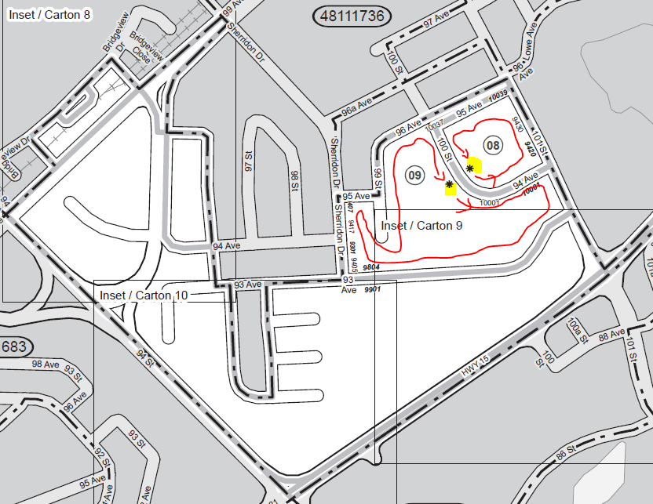

# Explanation of sequencing

The main reason that Sequencing is needed is to provide the starting locations and routes for enumerators to travel door to door 
in areas where we are gathering information for surveys. It also orders the blocks within a parent geography, known 
as a listing unit (LU) or collection unit (CU). By ordering the block faces (BF) for the enumerator, sequencing helps to minimize 
the total distance travelled, lessening the chances of backtracking or doubling over streets that have already been checked. An 
example of a start point and route in shown in the figure below.

Statistics Canada does not currently use digital field collection tablets to automatically route enumerators from one dwelling to 
the next. Block sequencing is therefore used to produce routes by area which are then output as maps. Paper maps in three different 
standardized sizes are produced for field workers, detailing a least cost route, and where to start for optimization.
